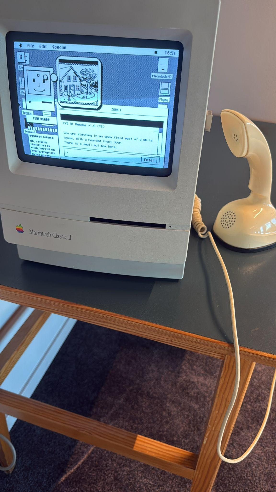
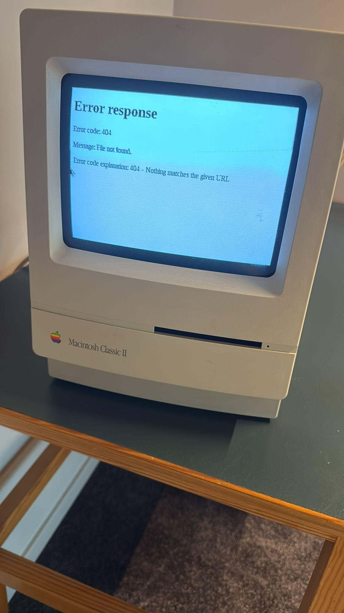
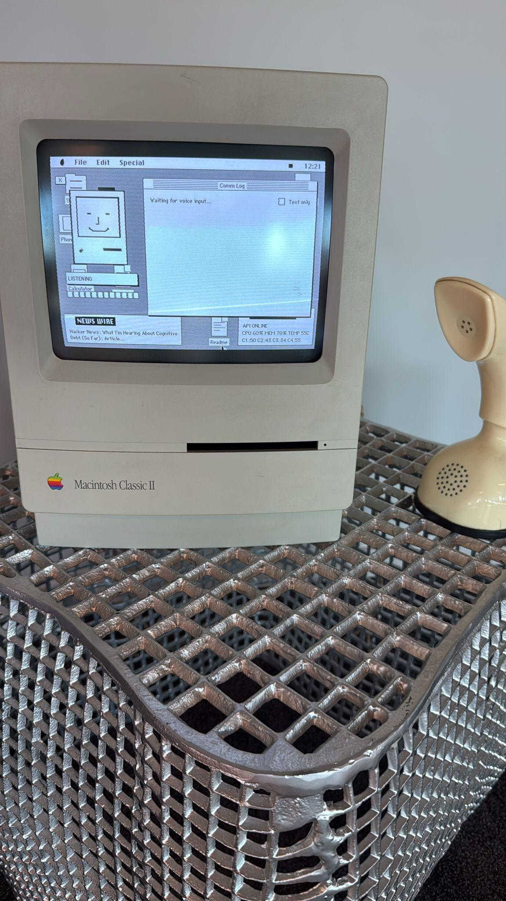
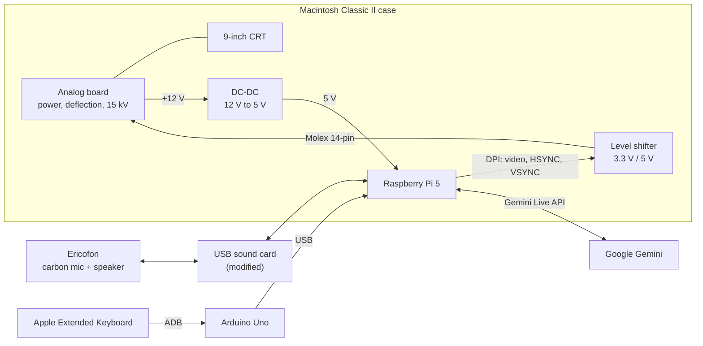
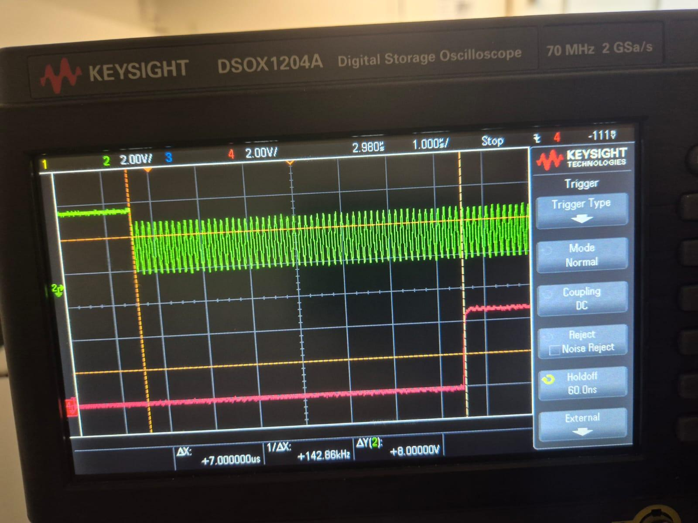

# Project ScrLk

The AI-assistant Happy Mac lives in a Macintosh Classic II from 1991. You talk to him through a cobra phone from 1956. Happy Mac controls the apps and games in the simulated OS environment and gives you tips about where to eat lunch. Happy Mac's favorite artists are Floyd-Steinberg.

## What it does

- **Pick up the phone and talk.** A Swedish Ericofon (the "cobra phone") is the microphone and speaker. Happy Mac answers through the handset and in writing on the screen.
- **Say "hey jarvis" to wake him.** A local wake-word model listens while the screensaver runs. Teaching it "hey mac" instead is on the list.
- **Real CRT, real pixels.** The original 9-inch monochrome tube shows 512×342 pixels at 60 Hz. Every pixel is either black or white: no grey, no antialiasing.
- **A little Mac of its own.** A System 6/7-style desktop with windows, icons, a calculator, notepad and terminal.
- **Games.** Doom in 1-bit monochrome with a dozen dithering styles to pick from. And a Zork remake where Happy Mac narrates and draws every scene live, dithered down to black and white.
- **Original keyboard.** A 1990 Apple Extended Keyboard, still speaking its native Apple Desktop Bus.

## Origin

During our electronics engineering studies at Yrgo we were interns at EQ2 in Gothenburg, Sweden. On the first day there our supervisor Johannes gave us the monochrome Macintosh Classic and the Ericofon and said: "I want to be able to talk to that computer through this phone".

Johannes had actually bought two Macs: a Macintosh Classic that worked, and a Macintosh Classic II that didn't work at all but was much less worn. So the Classic's insides moved into the nicer Classic II case.

The project was named ScrLk after the Scroll Lock key, a key almost nobody remembers the purpose of. That felt right for a project about giving something forgotten a new job. The AI became Happy Mac, after the smiling icon Susan Kare drew for the original Macintosh.

During the first internship in autumn 2025, my classmate [Felix Da Silva Gunnarsson](https://github.com/gunnarsson901) and I built a working prototype. The original logic board was replaced by a Raspberry Pi 5, and the handset was wired up through a modified USB sound card. At the school presentation the screen went black a minute in, and the games refused to start when it came back. But you could talk to Happy Mac through the cobra phone!

The prototype had grown into something that combined analog electronics from four decades with cloud AI. It deserved to be done properly, so I made it my degree project in spring 2026. The goal was a stable machine that boots straight into Happy Mac and survives a whole demo. The thesis (in Swedish) is here: [Examensarbete-Projekt-ScrLk.pdf](Examensarbete-Projekt-ScrLk.pdf).

## How it works

The Macintosh keeps its case, CRT and analog board, which does the power supply, the 15 kV for the tube and the deflection. Only the digital logic board is gone. In its place, a Raspberry Pi 5 generates the video and sync signals that the original logic board used to send.

## Hardware

> [!WARNING]
> A CRT holds around 15 kV on its anode, and the analog board's capacitors can stay charged long after the plug is pulled. Don't open a compact Mac unless you know how to discharge the tube safely. The steps we followed are in section 4.1 of the thesis.

### Driving the CRT from a Raspberry Pi 5

The Pi 5 has no analog video output. Instead it uses DPI (Display Parallel Interface), which puts raw pixel data and sync signals straight onto the GPIO pins. A device-tree overlay describes the Mac's timing to the kernel's KMS driver:

| | Horizontal | Vertical |
| --- | --- | --- |
| Visible | 512 px | 342 lines |
| Front porch | 15 | 1 |
| Sync pulse | 178 | 4 |
| Back porch | 2 | 24 |
| Total | 707 | 371 |
| Frequency | ≈ 22.16 kHz | ≈ 59.73 Hz |
| Sync polarity | active low | active low |

- **Pixel clock:** 15.6672 MHz.
- **Bus format:** Y8 greyscale (`0x2001`) instead of RGB565. The picture is 1-bit anyway, and this halves the DPI bandwidth.
- **Sync polarity:** both pulses are inverted compared to VESA, which is what the analog board expects.
- **Stable clock:** `force_turbo=1` in `config.txt` stopped a wavy, jittery picture.

Every signal was checked on an oscilloscope before the kernel driver was allowed to touch the tube.

### Connecting the Pi to the analog board

The original logic board talks to the analog board through a 14-position Molex connector. The Pi's 3.3 V GPIO goes through a bidirectional level shifter to meet the analog board's 5 V TTL levels, and a DC-DC converter powers the Pi from the 12 V rail.

| Pin | Signal | Direction | Notes |
| --- | --- | --- | --- |
| 1 | +12 V | from analog board | Feeds the DC-DC converter |
| 2 | +12 V GND | | |
| 3 | −12 V | from analog board | |
| 4 | +5 V | from analog board | |
| 5 | +5 V GND | | |
| 6 | Audio | to analog board | Internal speaker |
| 7 | Audio GND | | |
| 8 | Video | to analog board | 1-bit monochrome video |
| 9 | Video GND | | |
| 10 | HSYNC | to analog board | ≈ 22 kHz |
| 11 | VSYNC | to analog board | 60 Hz |
| 12 | HSYNC GND | | |
| 13 | reserved | | |
| 14 | reserved | | |

This pinout started from public schematics for the Macintosh family and was confirmed by measuring our own board. **Measure yours before connecting anything.** The pins sit close together, and a short between pin 1 (+12 V) and pin 8 (video) would kill the Pi's GPIO instantly.

### The Ericofon

The Ericofon has a carbon microphone, which needs a steady DC bias current to work, and a dynamic speaker element. A standard USB sound card was modified with a bias resistor and a capacitor-coupled microphone input, and its output drives the Ericofon's speaker.

There was almost nothing about the Ericofon's internals online. The circuit documentation came from binders of 1970s and 1980s drawings at Radiomuseet in Gothenburg.

Felix also built a ring generator (25 Hz, about 70 V AC) so the phone can actually ring. A mechanical relay keeps that voltage away from the sound card.

### The keyboard

The Apple Extended Keyboard speaks Apple Desktop Bus (ADB). An Arduino Uno R3 sits in between and translates ADB to USB. The ADB data line goes to GPIO 8, pulled up to 5 V through a 1 kΩ resistor, and the ATmega328P reads it with microsecond timing.
<!-- TODO: name and link the ADB-to-USB firmware project this is based on. -->

### Parts

| Part | Used for | Approx. price |
| --- | --- | --- |
| Raspberry Pi 5 (8 GB) | Main computer | 1 500 kr |
| microSD, 64 GB | OS storage | 200 kr |
| Macintosh Classic II | Case | secondhand |
| Macintosh Classic | CRT and analog board | secondhand |
| Ericofon | Microphone, speaker, hook switch | secondhand |
| USB sound card | Audio in and out | 150 kr |
| Level shifter, 3.3 V / 5 V | GPIO to analog board | 100 kr |
| DC-DC converter, 12 V to 5 V | Powers the Pi | 100 kr |
| Arduino Uno R3 | ADB-to-USB bridge | 250 kr |
| Apple Extended Keyboard | Input | secondhand |
| 1 kΩ resistor | ADB data pull-up | < 10 kr |
| Bias resistor + capacitor | Carbon microphone bias | < 20 kr |
| Mechanical relay | Protects the sound card from ring voltage | |
| Cables and connectors | | 300 kr |

## Software

- **OS:** Raspberry Pi OS Lite (64-bit), with the labwc Wayland compositor and Chromium in kiosk mode.
- **Happy Mac UI:** a React web app that imitates Mac System 6/7 in strict 1-bit. It uses bitmap fonts, no transparency, and images dithered on the server.
- **Backend:** a Python FastAPI service for system status, games, image dithering and health checks.
- **Voice:** the Google Gemini Live API, with a system prompt that gives Happy Mac his personality.
- **Wake word:** [openWakeWord](https://github.com/dscripka/openWakeWord), running locally on the Pi.
- **Doom:** a 1-bit monochrome fork of [Chocolate Doom](https://github.com/chocolate-doom/chocolate-doom).
- **Provisioning:** Ansible sets up the whole Pi from a fresh SD card.

Much of the software was written with Claude Code. The hardware work still needed hands, a multimeter and an oscilloscope.

## Things that went wrong

- **The capacitors that weren't.** A smell, a flickering picture, long black-screen periods and sudden power cuts all pointed at dying electrolytic capacitors, the classic compact-Mac failure. It turned out to be a runaway render loop pinning one CPU core at 100%. Fixing the bug made every symptom go away. Linux's average CPU figure had hidden it (one core at 100% and four at 20% read as 40%), so the UI now shows per-core load.
- **Audio is harder than video.** Getting the right fonts took weeks, but stabilizing the audio chain took longer. Competing audio drivers, a carbon microphone, and a USB sound card that can be pulled out mid-demo all made trouble. At one point the wake-word service believed it was listening to a microphone that was delivering near-silence.
- **Cloud APIs change without asking.** Gemini's behavior changed with no visible version bump. Only tests of the running system noticed.
- **Measure first, connect later.** A mistake on the 12 V rail can kill a Pi 5 instantly. We learned that the hard way.

## Known issues and next steps

- Occasional USB over-current warnings and flicker under heavy load. The suspect is the level shifter, and a replacement is planned.
- The sound card can give an unpleasantly sharp shock when touched, and audio stops when it happens.
- Galvanic isolation on the audio path, to keep noise from the digital side out of the handset.
- An I2S DAC instead of the USB sound card, for lower latency.
- A custom interface PCB instead of modules and jumper wires, to remove the risk of shorts.
- A wake word trained on "hey mac", and eventually on Swedish pronunciation.

## Code

The source code isn't published yet. It was built for a specific installation and needs cleaning up before it can go public. The display timing above is the most reusable part, and the plan is to publish that first.

## Credits and inspiration

- Johannes at EQ2, for the two Macs, the phone and the idea.
- [Felix Da Silva Gunnarsson](https://github.com/gunnarsson901), for the prototype chassis work, the pinout measurements and the ring generator.
- Susan Kare, whose Happy Mac icon gave the AI its name and face.
- Radiomuseet in Gothenburg, for the Ericofon drawings.
- Bob Paradiso's Macintosh Classic II schematics, and the [bitsavers.org](http://bitsavers.org) archive.
- Projects that showed a new computer in an old case can work: Frank Chiarulli's "Building the Rcade", Duncan Hall's restomod Macintosh SE, [likeablob/macmini](https://github.com/likeablob/macmini) and [sakofchit/system.css](https://github.com/sakofchit/system.css).
