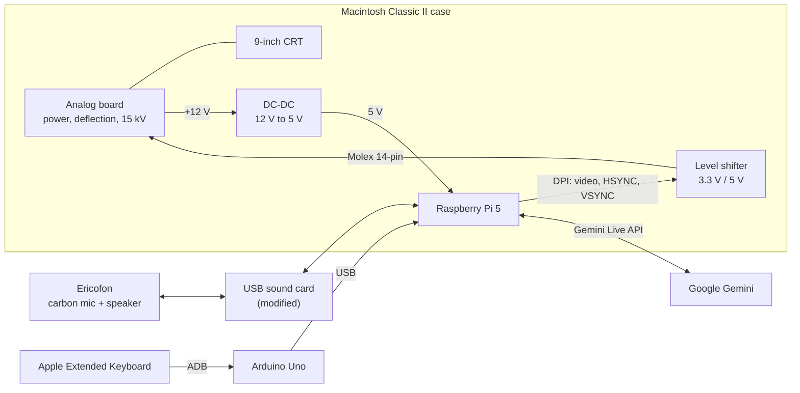

# Project ScrLk

The AI-assistant Happy Mac lives in a Macintosh Classic II from 1991. You talk to him through a cobra phone from 1956. Happy Mac controls the apps and games in the simulated OS environment and gives you tips about where to eat lunch. Happy Mac's favorite artists are Floyd-Steinberg.

## What it does

- **Talk to him through the phone.** A Swedish Ericofon (the "cobra phone") is the microphone and speaker. Say "hey jarvis" into the handset to wake him, and he answers through the handset and in writing on the screen, in Swedish or English, whichever you speak. Teaching him to answer to "hey mac" is on the list.
- **Real CRT, real pixels.** The original 9-inch monochrome tube shows 512×342 pixels at 60 Hz. Every pixel is either black or white: no grey, no antialiasing.
- **An office companion.** Ask him where to eat lunch, what the weather will do, or what's in the news. [More below.](#talking-to-happy-mac)
- **A little Mac of its own.** A System 6/7-style desktop with windows, icons, a calculator, notepad and terminal, running on Linux underneath. [More below.](#the-os)
- **Games.** Zork with Happy Mac as your guide, imagining every room in a thought bubble. Doom in pure black and white. And Bonk!, a two-player brawler. [More below.](#games)
- **Original keyboard.** A 1990 Apple Extended Keyboard, still speaking its native Apple Desktop Bus.

## Origin

During our electronics engineering studies at Yrgo we were interns at EQ2 in Gothenburg, Sweden. On the first day there our supervisor Johannes gave us the monochrome Macintosh Classic and the Ericofon and said: "I want to be able to talk to that computer through this phone".

Johannes had actually bought two Macs: a Macintosh Classic that worked, and a Macintosh Classic II that didn't work at all but was much less worn. So the Classic's insides moved into the nicer Classic II case.

The project was named ScrLk after the Scroll Lock key, a key almost nobody remembers the purpose of. That felt right for a project about giving something forgotten a new job. The AI became Happy Mac, after the smiling icon Susan Kare drew for the original Macintosh.

During the first internship in autumn 2025, my classmate [Felix Da Silva Gunnarsson](https://github.com/gunnarsson901) and I built a working prototype. The original logic board was replaced by a Raspberry Pi 5, and the handset was wired up through a modified USB sound card. At the school presentation the screen went black a minute in, and the games refused to start when it came back. But you could talk to Happy Mac through the cobra phone!

The prototype had grown into something that combined analog electronics from four decades with cloud AI. It deserved to be done properly, so I made it my degree project in spring 2026. The goal was a stable machine that boots straight into Happy Mac and survives a whole demo. The thesis (in Swedish) is here: [Examensarbete-Projekt-ScrLk.pdf](Examensarbete-Projekt-ScrLk.pdf).

## Talking to Happy Mac

Happy Mac lives at the EQ2 office. The idea is that people chat with him about simple, everyday things, and discover along the way that there's a lot more he can do.

Lunch is the way in. There's a lunch menu on the desktop with today's menus from restaurants near the office, but it's really there to get people to ask Happy Mac instead. Ask him where to eat and he suggests two or three places. He weighs the weather (somewhere closer on a rainy day), vegetarian needs, and what you liked last time. He also knows which restaurants just opened in town ("Has anyone tried it yet?"). Tell him how a place was, and he remembers your verdict.

From there, people find the rest:

- He speaks Swedish or English, matching whoever is talking to him.
- He remembers your name and the things you care about between conversations.
- He has his own email address, subscribed to tech newsletters, so he always has the latest tech news to talk about. He also knows the weather and the time, and can look up anything else on the web.
- For deeper questions he can search Gemini Notebooks (formerly NotebookLM). That runs in the background: he answers right away and weaves in what he finds when the results arrive.
- He can look at live network traffic from the EQ200L, a passive network tap that is Felix's own degree project, and tell you what's on the wire. He can only watch, never interfere.
- Ask him how he's feeling and you get his CPU temperature and memory use.
- Say "louder" or "quieter" and he changes his volume. He can also move his voice from the handset to a Bluetooth speaker, so a whole room can listen.
- He opens and closes apps and starts games. Before he reboots himself, he asks you to confirm out loud.
- Ask him to pass a note to Edward and it arrives on Telegram.
- He isn't stuck on the desk. He answers email and Telegram messages with the same personality, and there's a phone version of the handset for talking to him from anywhere.

His face is alive too: he blinks when you click on him, fidgets when idle, and shakes when he's thinking hard.

I keep adding new things for him to do.

## Games

### Zork, with Happy Mac as your guide

Zork I is the classic 1980 text adventure: *"You are standing in an open field west of a white house, with a boarded front door."* Here it runs as a from-scratch remake, and Happy Mac plays it with you. Tell him out loud what you want to do: "open the mailbox", "go north", "attack the troll with the sword". He sends the commands to the game and retells what happens in his own words. You can also type commands on the keyboard, the old-fashioned way.

The best part is that he imagines where you are. The first time you walk into a room, a thought bubble pops up beside Happy Mac's face, with a trail of little circles leading back to him, and he might say something like "I can almost picture it…". While he thinks, the bubble reads DREAMING…. Some seconds later the scene appears inside it: a small 128×128-pixel picture, painted by Google's image model from a description Happy Mac writes of the room. It is then dithered to pure black and white with Atkinson dithering, the method Bill Atkinson came up with at Apple for the original Macintosh. He never mentions generating or loading anything; he is just imagining. The photo at the top of this page shows it: that's the white house in his thought bubble.

The pictures belong to the places. Walk back into a room and he remembers what it looked like. But if something visibly changes it, like lighting the lamp, opening the grating or killing the troll, he imagines the room again. Start a new game and every room gets new art.

### Doom in 1 bit

Doom on a screen that can only show black or white. It runs on a 1-bit fork of Chocolate Doom (a source port that stays faithful to the 1993 original), and the fork turns every frame into pure black and white on the fly. It knows more than twenty ways to do that: classic Floyd-Steinberg and Atkinson, ordered Bayer patterns, blue noise, and effects that fake an old tube, like "phosphor trail" and "tube glow". Press M mid-game to switch to the next one, and a small badge shows which is active. The menus were redrawn with a plain bitmap font on a black panel so they stay readable on the CRT.

Ask Happy Mac whether he can play Doom and he answers "I thought you'd never ask!" and starts it. The Mac desktop steps aside while Doom has the whole screen, and comes back when you quit.

### Bonk!

A two-player brawler I made for the Mac desktop. Both players share the keyboard (WASD or the arrow keys and Space against IJKL), or player two grabs a gamepad. Jump between platforms, hold your bonk button to charge, and let go to dash. When you collide, whoever is moving faster stuns the other and sends them flying. Knock your opponent off the screen to score; first to five wins.

## How it works

The Macintosh keeps its case, CRT and analog board, which does the power supply, the 15 kV for the tube and the deflection. Only the digital logic board is gone. In its place, a Raspberry Pi 5 generates the video and sync signals that the original logic board used to send.

## Hardware

> [!WARNING]
> A CRT holds around 15 kV on its anode, and the analog board's capacitors can stay charged long after the plug is pulled. Don't open a compact Mac unless you know how to discharge the tube safely. The steps we followed are in section 4.1 of the thesis.

### Driving the CRT from a Raspberry Pi 5

The Pi 5 has no analog video output. Instead it uses DPI (Display Parallel Interface), which puts raw pixel data and sync signals straight onto the GPIO pins. A device-tree overlay describes the Mac's timing to the kernel's KMS driver. The overlay and a reference `config.txt` are public in [macintosh-timings](https://github.com/edwardfalk/macintosh-timings).

| | Horizontal | Vertical |
| --- | --- | --- |
| Visible | 512 px | 342 lines |
| Front porch | 15 | 1 |
| Sync pulse | 178 | 4 |
| Back porch | 2 | 24 |
| Total | 707 | 371 |
| Frequency | ≈ 22.16 kHz | ≈ 59.73 Hz |
| Sync polarity | active low | active low |

- **Pixel clock:** 15.6672 MHz.
- **Bus format:** Y8 greyscale (`0x2001`) instead of RGB565. The picture is 1-bit anyway, and this halves the DPI bandwidth.
- **Sync polarity:** both pulses are inverted compared to VESA, which is what the analog board expects.
- **Stable clock:** `force_turbo=1` in `config.txt` stopped a wavy, jittery picture.

Every signal was checked on an oscilloscope before the kernel driver was allowed to touch the tube.

### Connecting the Pi to the analog board

The original logic board talks to the analog board through a 14-position Molex connector. The Pi's 3.3 V GPIO goes through a bidirectional level shifter to meet the analog board's 5 V TTL levels, and a DC-DC converter powers the Pi from the 12 V rail.

| Pin | Signal | Direction | Notes |
| --- | --- | --- | --- |
| 1 | +12 V | from analog board | Feeds the DC-DC converter |
| 2 | +12 V GND | | |
| 3 | −12 V | from analog board | |
| 4 | +5 V | from analog board | |
| 5 | +5 V GND | | |
| 6 | Audio | to analog board | Internal speaker |
| 7 | Audio GND | | |
| 8 | Video | to analog board | 1-bit monochrome video |
| 9 | Video GND | | |
| 10 | HSYNC | to analog board | ≈ 22 kHz |
| 11 | VSYNC | to analog board | 60 Hz |
| 12 | HSYNC GND | | |
| 13 | reserved | | |
| 14 | reserved | | |

This pinout started from public schematics for the Macintosh family and was confirmed by measuring our own board. **Measure yours before connecting anything.** The pins sit close together, and a short between pin 1 (+12 V) and pin 8 (video) would kill the Pi's GPIO instantly.

### The Ericofon

The Ericofon has a carbon microphone, which needs a steady DC bias current to work, and a dynamic speaker element. A standard USB sound card was modified with a bias resistor and a capacitor-coupled microphone input, and its output drives the Ericofon's speaker.

There was almost nothing about the Ericofon's internals online. The circuit documentation came from binders of 1970s and 1980s drawings at Radiomuseet in Gothenburg.

Felix also built a ring generator (25 Hz, about 70 V AC) so the phone could ring, with a mechanical relay to keep that voltage away from the sound card. It isn't part of the working system yet.

### The keyboard

The Apple Extended Keyboard speaks Apple Desktop Bus (ADB). An Arduino Uno R3 sits in between and translates ADB to USB. The ADB data line goes to GPIO 8, pulled up to 5 V through a 1 kΩ resistor, and the ATmega328P reads it with microsecond timing.
<!-- TODO: name and link the ADB-to-USB firmware project this is based on. -->

### Parts

| Part | Used for | Approx. price |
| --- | --- | --- |
| Raspberry Pi 5 (8 GB) | Main computer | 1 500 kr |
| microSD, 64 GB | OS storage | 200 kr |
| Macintosh Classic II | Case | secondhand |
| Macintosh Classic | CRT and analog board | secondhand |
| Ericofon | Microphone, speaker, hook switch | secondhand |
| USB sound card | Audio in and out | 150 kr |
| Level shifter, 3.3 V / 5 V | GPIO to analog board | 100 kr |
| DC-DC converter, 12 V to 5 V | Powers the Pi | 100 kr |
| Arduino Uno R3 | ADB-to-USB bridge | 250 kr |
| Apple Extended Keyboard | Input | secondhand |
| 1 kΩ resistor | ADB data pull-up | < 10 kr |
| Bias resistor + capacitor | Carbon microphone bias | < 20 kr |
| Mechanical relay | Protects the sound card from ring voltage | |
| Cables and connectors | | 300 kr |

## The OS

Happy Mac's "operating system" has two halves. What you see is a Mac desktop built as a web app. Underneath it is an ordinary Linux system, set up so that nobody ever sees it.

### The desktop

It looks and behaves like System 6/7:

- **Menu bar:** the Apple, File, Edit and Special menus, with a clock in the corner.
- **Icons:** Macintosh HD, Floppy and Trash, next to icons for the games and apps.
- **Windows:** you can drag them, minimize them and switch between them.
- **Sticky notes:** you can stick them on the desktop and cut, copy or duplicate them.
- **Shortcuts:** ⌘K opens a command palette, ⌘N opens a new notepad and ⌘W closes the front window.

The apps are a Calculator, a Notepad, a Messages window, a web browser that forces pages into black and white, and a Terminal. The Terminal is a real Linux shell in a 1-bit window. The Settings control panel holds the font choices and Doom's launch options.

A few small widgets live on the desk:

- **Workstation** shows the load on each CPU core (see [Things that went wrong](#things-that-went-wrong) for why).
- **News Wire** runs the latest headlines.
- **Lunchtips** shows a rotating restaurant example, to nudge people into asking Happy Mac about lunch.
- **Audio Health** shows whether the handset microphone is actually hearing anything.

### How the desktop is built

The desktop is a React app running full screen in Chromium. Everything on it (windows, menus, desktop icons, widgets and dialogs) is described as data in a set of **blueprints**. A window's blueprint says what it's called, whether there can be one or several, and which commands open and close it. A small runtime reads the blueprints and builds the desktop from them, so adding an app means writing its contents and one blueprint entry. Menus, keyboard shortcuts, the command palette and the desktop icons all trigger the same named commands, so "open Zork" works the same way everywhere.

Keeping every pixel black or white took real work, because browsers produce grey in a dozen quiet ways:

- **Widgets:** the controls come from a library of more than 30 Mac-style widgets (buttons, windows, menus, scroll bars, alerts), each built so it can never produce a grey pixel.
- **Banned styles:** transparency, semi-transparent colors and rounded corners (which get smoothed edges) are not allowed. Curves are drawn as pixel-exact shapes, and disabled buttons use dither patterns instead of fading out.
- **Automatic checks:** lint rules, a check whenever code is written, and a reviewer afterwards all enforce this, because each catches different mistakes. A script also captures the real screen output and checks it for grey.
- **Fonts:** text uses the original Mac bitmap fonts (Chicago, Geneva, Monaco). They are converted into a format the canvas can draw pixel by pixel, and into web fonts for text fields, so no letter is ever smoothed.

### Underneath

- **Base system:** Raspberry Pi OS Lite (64-bit), without the full desktop install.
- **Startup:** LightDM logs in and starts labwc, a small Wayland compositor. labwc launches Chromium in kiosk mode, pointed at the desktop.
- **Web server:** Caddy serves the desktop and forwards API calls to the backend.
- **Backend:** a Python FastAPI service, run by systemd. It handles the games, image dithering, system status, messaging and the wake word.
- **Voice:** the Google Gemini Live API, with a system prompt that gives Happy Mac his personality.
- **Wake word:** [openWakeWord](https://github.com/dscripka/openWakeWord), running locally on the Pi. PipeWire routes audio between the handset, the Bluetooth speaker and the wake-word listener.
- **No smoothed text anywhere:** font smoothing is switched off for the whole system, so even native Linux programs render in 1 bit.
- **Doom:** a 1-bit fork of [Chocolate Doom](https://github.com/chocolate-doom/chocolate-doom) that runs as a native Wayland program. Chromium steps aside while it has the screen.
- **Health checks:** systemd timers regularly check the display chain (kernel graphics, compositor and Chromium) and the CPU load. They also back up Happy Mac's memories every day.
- **Remote access:** a Cloudflare Tunnel makes the phone handset reachable without opening any ports.
- **Setup:** Ansible builds the whole Pi from a fresh SD card.

Much of the software was written with AI coding assistants, mostly Claude Code. The hardware work still needed hands, a multimeter and an oscilloscope.

## Things that went wrong

- **The capacitors that weren't.** A smell, a flickering picture, long black-screen periods and sudden power cuts all pointed at dying electrolytic capacitors, the classic compact-Mac failure. It turned out to be a runaway render loop pinning one CPU core at 100%. Fixing the bug made every symptom go away. Linux's average CPU figure had hidden it (one core at 100% and the other three at 20% average out to 40%), so the UI now shows per-core load.
- **Audio is harder than video.** Getting the right fonts took weeks, but stabilizing the audio chain took longer. Competing audio drivers, a carbon microphone, and a USB sound card that can be pulled out mid-demo all made trouble. At one point the wake-word service believed it was listening to a microphone that was delivering near-silence.
- **Cloud APIs change without asking.** Gemini's behavior changed with no visible version bump. Only tests of the running system noticed.
- **Measure first, connect later.** A mistake on the 12 V rail can kill a Pi 5 instantly. We learned that the hard way.

## Known issues and next steps

- Occasional USB over-current warnings and flicker under heavy load. The suspect is the level shifter, and a replacement is planned.
- The sound card can give an unpleasantly sharp shock when touched, and audio stops when it happens.
- Galvanic isolation on the audio path, to keep noise from the digital side out of the handset.
- An I2S DAC instead of the USB sound card, for lower latency.
- A custom interface PCB instead of modules and jumper wires, to remove the risk of shorts. Felix started a Raspberry Pi HAT for this in KiCad during the prototype.
- A wake word trained on "hey mac", and eventually on Swedish pronunciation.
- Answer by picking up the phone. The Ericofon has a hook button underneath; reading it would let people lift the handset to talk, without saying a wake word.
- Let Happy Mac ring. With the ring generator working, the phone could ring at 11:45, and whoever picks up gets asked where they want to eat.

## Code

The source code isn't published yet. It was built for a specific installation and needs cleaning up before it can go public. The most reusable part, the display overlay, is already public in [macintosh-timings](https://github.com/edwardfalk/macintosh-timings).

## Credits and inspiration

- Johannes at EQ2, for the two Macs, the phone and the idea.
- [Felix Da Silva Gunnarsson](https://github.com/gunnarsson901), for the prototype chassis work, the pinout measurements and the ring generator. His [ScrLk repo](https://github.com/gunnarsson901/ScrLk) has the prototype-era work from autumn 2025.
- Susan Kare, whose Happy Mac icon gave the AI its name and face.
- [Radiomuseet in Gothenburg](https://radiomuseet.se/info/panoramor/aktuell/fartygsradio.html), for the Ericofon drawings.
- Bob Paradiso's Macintosh Classic II schematics, and the [bitsavers.org](http://bitsavers.org) archive.
- Projects that showed a new computer in an old case can work: Frank Chiarulli's "Building the Rcade", Duncan Hall's restomod Macintosh SE, [likeablob/macmini](https://github.com/likeablob/macmini) and [sakofchit/system.css](https://github.com/sakofchit/system.css).
