# Architecture

The thesis ([Examensarbete-Projekt-ScrLk.pdf](../Examensarbete-Projekt-ScrLk.pdf), in Swedish) points here for an illustrated, up-to-date version of its system overview. That overview now lives in the [README](../README.md), with photos, the system diagram and the full pinout. This page maps the thesis chapters to it.

| Thesis | Where it is now |
| --- | --- |
| 3 System overview | [How it works](../README.md#how-it-works): the system diagram |
| 4.1 Analog board, CRT and safety | [Hardware](../README.md#hardware) |
| 4.2–4.3 Molex connector, level shifter, power | [Connecting the Pi to the analog board](../README.md#connecting-the-pi-to-the-analog-board) |
| 4.4 DPI/KMS and timing | [Driving the CRT from a Raspberry Pi 5](../README.md#driving-the-crt-from-a-raspberry-pi-5), with the oscilloscope capture |
| 4.5–4.6 Ring generator, Ericofon | [The Ericofon](../README.md#the-ericofon) |
| 4.7 ADB keyboard | [The keyboard](../README.md#the-keyboard) |
| 5 Software | [The OS](../README.md#the-os) and [Underneath](../README.md#underneath) |
| 7.2–7.3 Lessons, improvements | [Things that went wrong](../README.md#things-that-went-wrong) and [Known issues and next steps](../README.md#known-issues-and-next-steps) |
| Appendix A, parts list | [Parts](../README.md#parts) |
| Appendix B, DPI overlay | [macintosh-timings](https://github.com/edwardfalk/macintosh-timings) |
| Appendix E, photos and video | Photos are in the README and [below](#the-build-in-pictures). Video from the build is being collected and will be added here. |

## What has changed since the thesis

- **The two Macs.** The thesis describes the prototype from the first internship, which was in the Classic's own case. Later the working Classic's CRT and analog board moved into the less worn Classic II case, which is the badge on the finished machine.
- **The USB over-current warnings.** The thesis blames an undersized level shifter. The best guess now is the power path: the Pi 5 draws its peaks from the analog board's 12 V rail through a small DC-DC module. See [Known issues](../README.md#known-issues-and-next-steps).

## The build in pictures

More photos from the build, beyond the ones in the README, roughly in the order they were taken.

  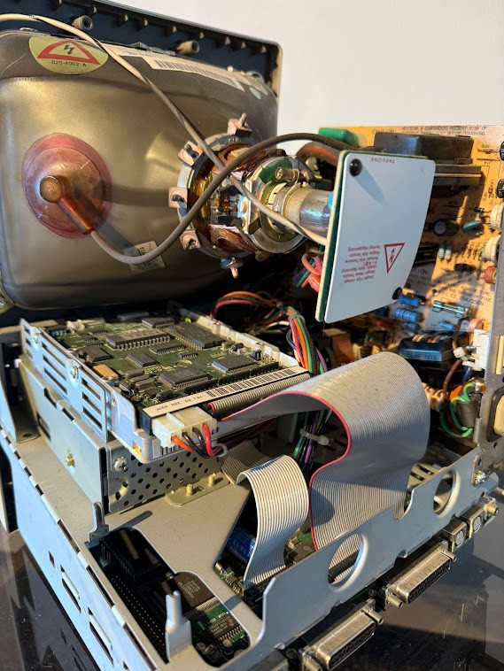
  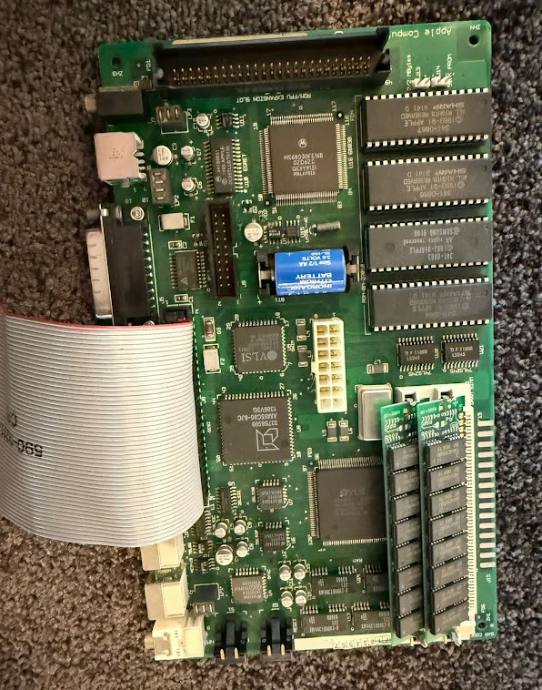

*Before the original parts came out, with the hard drive still mounted, and one of the original logic boards.*

  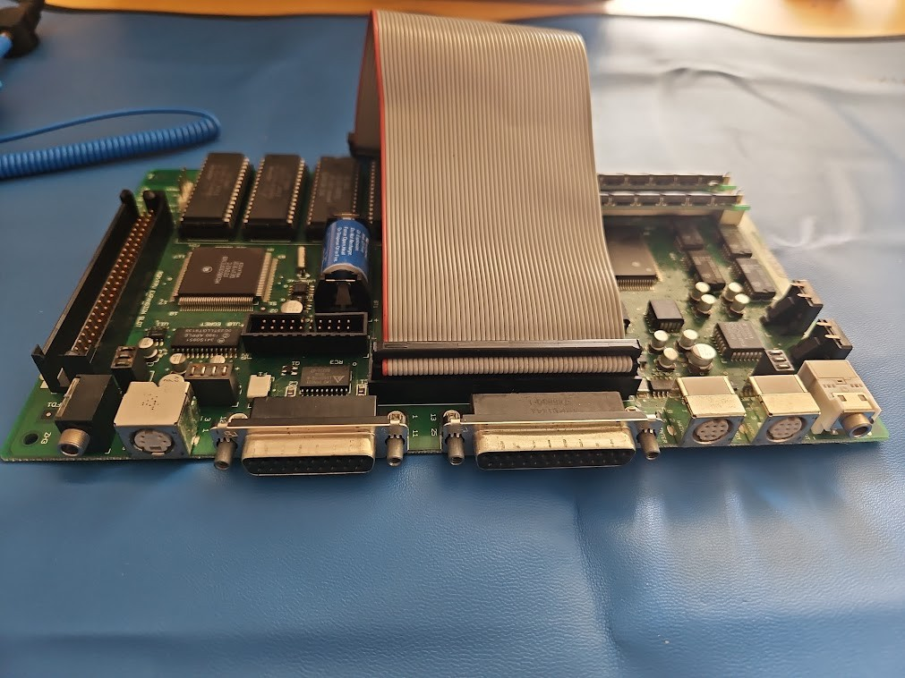

*October 2025: a logic board out of its Mac, on the ESD mat.*

  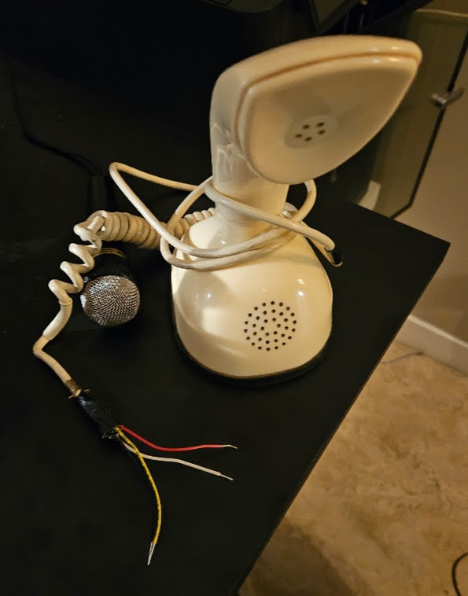
  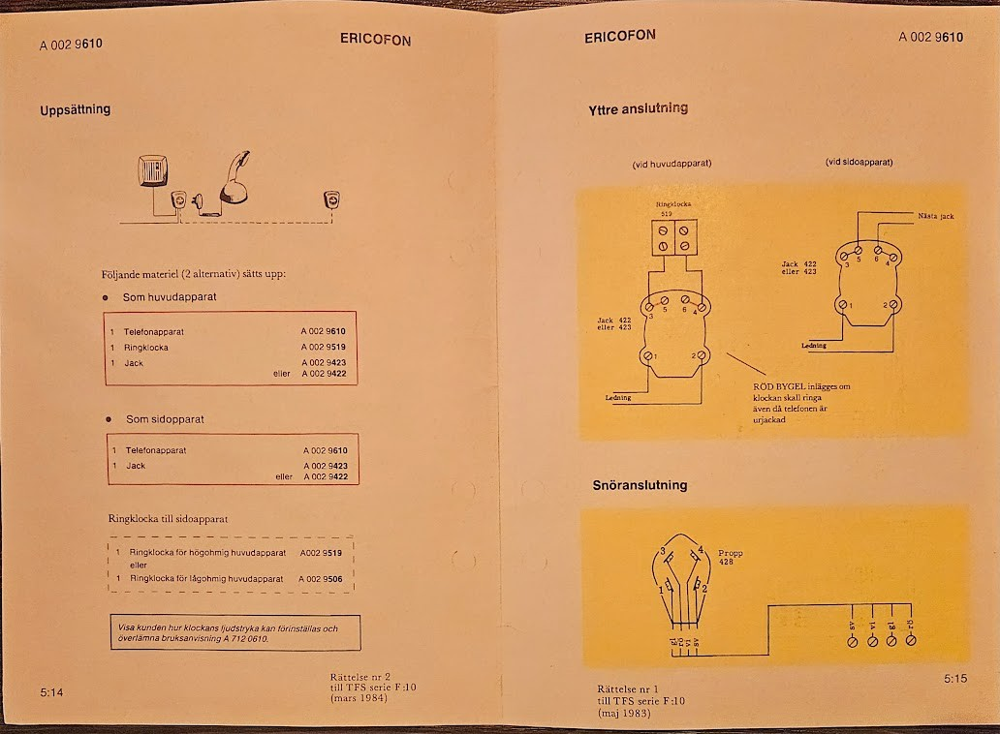

*Left: October 2025, no going back: the Ericofon's cord cut open. Right: the Ericofon's installation instructions, from the same Radiomuseet binders as the circuit diagram in the README.*

  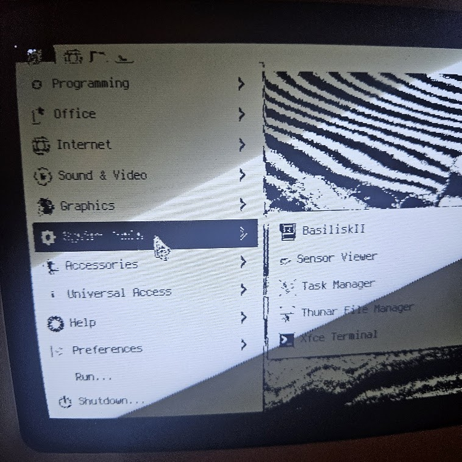

*November 2025: thin white stripes across the black areas, from the same bring-up as the banding in the README. The menu lists BasiliskII, a classic Mac emulator. Running the real System 7 in an emulator was tried early on, before the desktop was built from scratch.*

  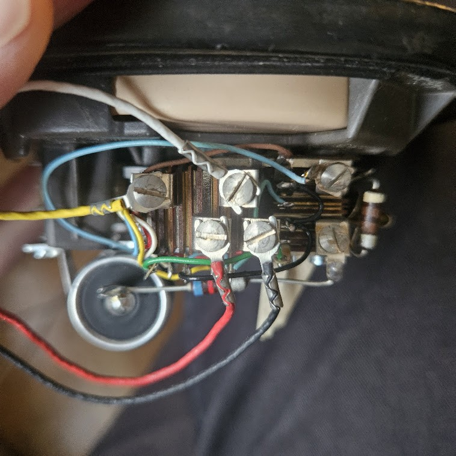
  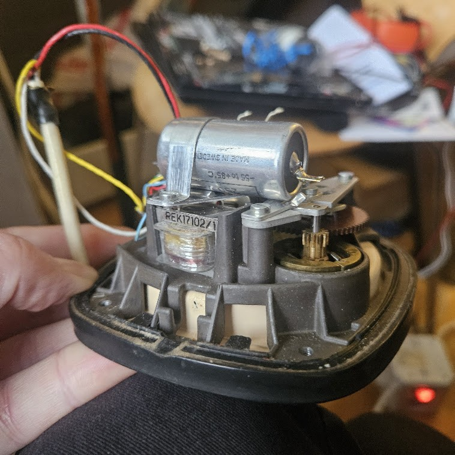

*November 2025: inside the Ericofon's base.*

  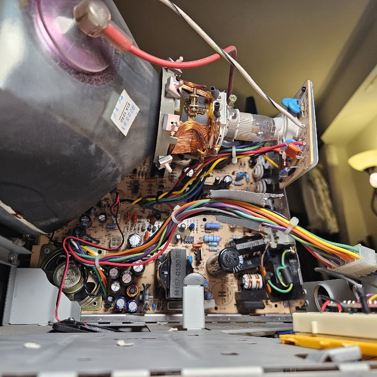

*December 2025: the neck of the tube and the analog board below it.*

  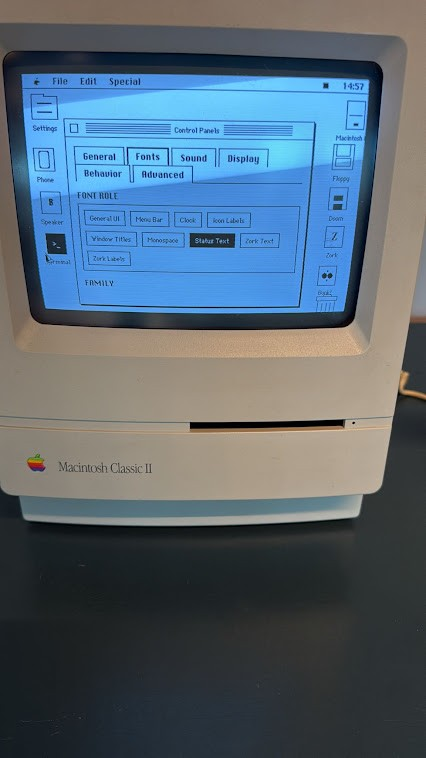
  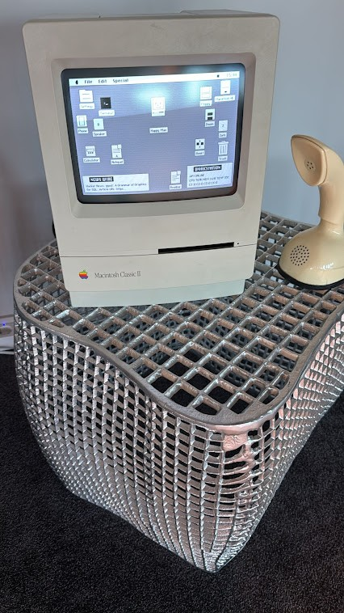

*Left: choosing fonts in the Settings control panel. Right: the finished Mac, at home at EQ2.*
